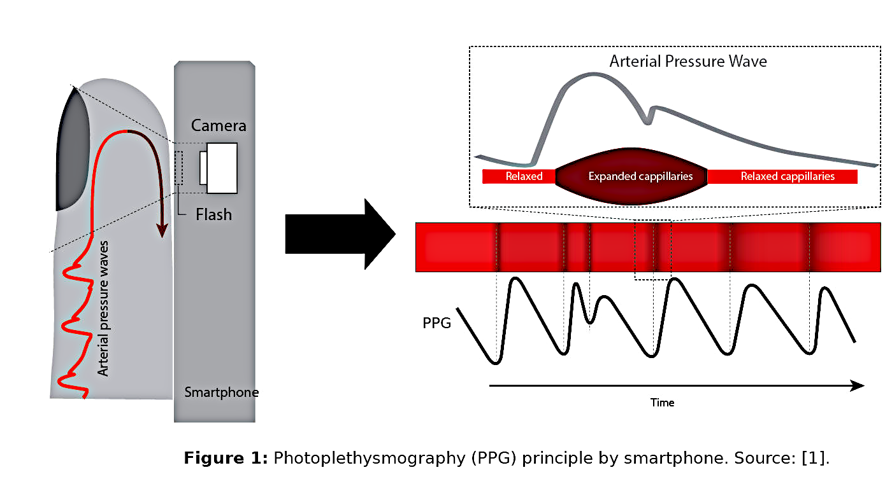

# PPG sample collection

**Vital signs monitor based on PPG signal captured by smartphone camera**

This repository is for demonstration purpuses only, as a proof of concept, that we can capture good enough PPG signal from any modern smartphone and that the captured PPG signal is good enough to estimate different cardiovascular metrics (in particular the blood glucose level). To evaluate the estimated values, we compare them to the values we get from a certifed medical device (e.g. glucometer that you can buy in a pharmacy store).

You can test the demo application by visiting the following website from your smartphone (for details see the Instructions below):
[https://dedsec-1.github.io/PPG-Sample-Collection/](https://dedsec-1.github.io/PPG-Sample-Collection/)

## Description

The application uses the smartphone flashlight and camera to capture the photoplethysmogram (PPG) signal from the color intensity changes in the fingertip as shown in **Figure 1**. With improved lenses and ability to capture video at higher rates (approaching the clinical pulse-oximeter at 100 Hz), smartphones are getting more capable of capturing good quality PPG signal. Although smartphones have been successfully used to determine heart rate, to estimate blood pressure or blood glucose level, the quality of captured PPG signal needs to be substantially better. This application is created to test some methodology of cleaning the captured noisy signals so we can also estimate the blood pressure or blood glucose level by using a smartphone.

## Instructions

 To test the application:
 
- Visit: [applications website](https://dedsec-1.github.io/PPG-Sample-Collection/)
 from your smartphone.
- Place the smartphone in the palm of your hand and press the `Measure` button; see **Figure 2 (a)**.
- Cover both the camera and the flashlight with your finger as shown in **Figure 1**.
- In case the signal doesn't look periodic as in **Figure 2 (b)** you can try:
    - applying less finger pressure on the lens of the camera;
    - be still without moving the finger;
    - be more calm without rapid breathing;
    - be patient and wait for the graph to shift to the new values.

